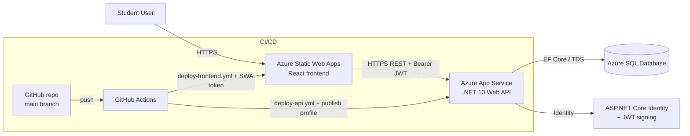
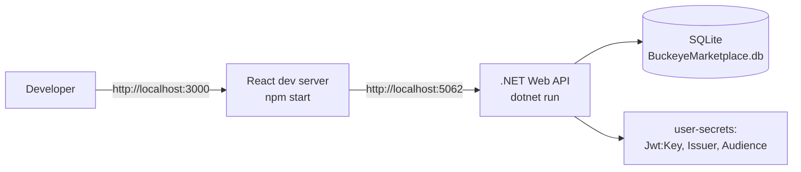

# System Architecture (Updated for Milestone 6)

## Overview

Buckeye Marketplace is a full-stack web application running on Azure. The Milestone 1 architecture was a Postgres + cloud-host placeholder; the production system shipped in Milestone 6 uses the stack below.

| Layer    | Technology                                            | Hosting                          |
|----------|-------------------------------------------------------|----------------------------------|
| Frontend | React 19 + TypeScript + React Router 7 (CRA build)    | Azure Static Web Apps             |
| Backend  | ASP.NET Core 10 Web API + EF Core + Identity + JWT    | Azure App Service (Linux, F1)    |
| Database | SQLite locally · Azure SQL Database (Basic) in prod    | Azure SQL Server                 |
| Auth     | ASP.NET Core Identity + HS256-signed JWT              | embedded in API                  |
| CI/CD    | GitHub Actions (ci.yml, deploy-api.yml, deploy-frontend.yml) | GitHub                           |

---

## Production architecture (Milestone 6)

---

## Local development architecture

---

## Key design choices

- **Stateless API.** All authenticated state lives in a JWT signed by the API. Sessions are not stored server-side.
- **CORS scoped via configuration.** `Cors:AllowedOrigins` is read from configuration, so each environment supplies only its frontend origin.
- **Provider-aware EF Core registration.** The DI container picks `UseSqlServer` when the connection string targets Azure SQL and `UseSqlite` otherwise. The `DbSeeder` similarly chooses `EnsureCreatedAsync` for SQL Server (where the SQLite-flavored migrations don't apply) and `MigrateAsync` for SQLite.
- **Defense in depth on headers.** Both the API middleware and the Static Web Apps `globalHeaders` set `X-Content-Type-Options: nosniff`, `X-Frame-Options: DENY`, and `Referrer-Policy: no-referrer`.
- **Secrets isolation.** No secrets are ever in the repo — `Jwt:Key` lives in user-secrets locally and App Service Application settings in production. The Azure publish profile lives only in GitHub repo secrets.
