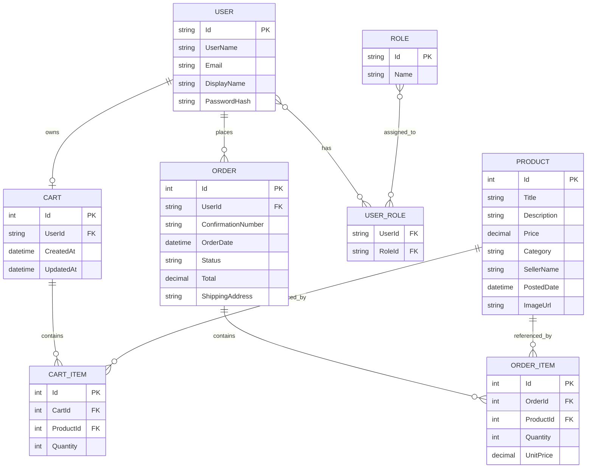

# Database ERD (Updated for Milestone 6)

## Overview

The schema deployed to Azure SQL Database in Milestone 6 reflects the Identity, cart, and order tables built across Milestones 4 and 5. Identity tables (`AspNetRoles`, `AspNetRoleClaims`, `AspNetUserClaims`, `AspNetUserLogins`, `AspNetUserTokens`) are created by ASP.NET Core Identity and are omitted from the diagram for clarity; the only ones shown are the user table (`AspNetUsers`, modeled here as `USER`) and the join `USER_ROLE` (`AspNetUserRoles`).

---

## Entity Relationship Diagram

---

## Notes

- `Cart.UserId` is unique per user (each user has at most one open cart) and is set from the JWT subject claim, never from the request body.
- `Order.UserId` is set the same way at order placement; subsequent reads scope by JWT user id (mitigates BOLA).
- `OrderItem.UnitPrice` snapshots the price at order time, so price edits to `Product` do not affect placed orders.
- Cascade delete is configured between `Cart → CartItem` and `Order → OrderItem`. `Product → CartItem` and `Product → OrderItem` are configured restrict so deleting a product cannot orphan paid orders.
